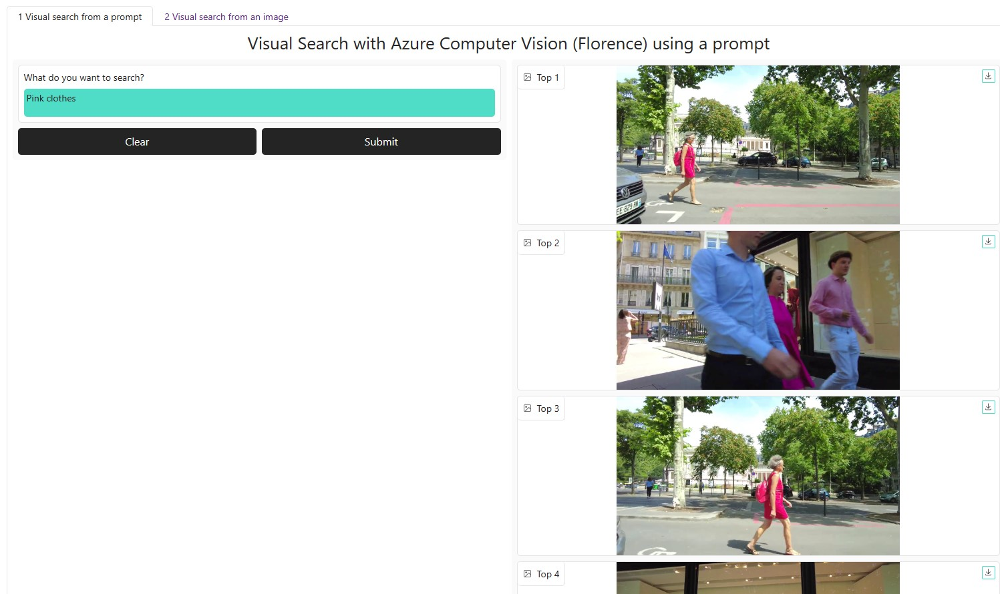
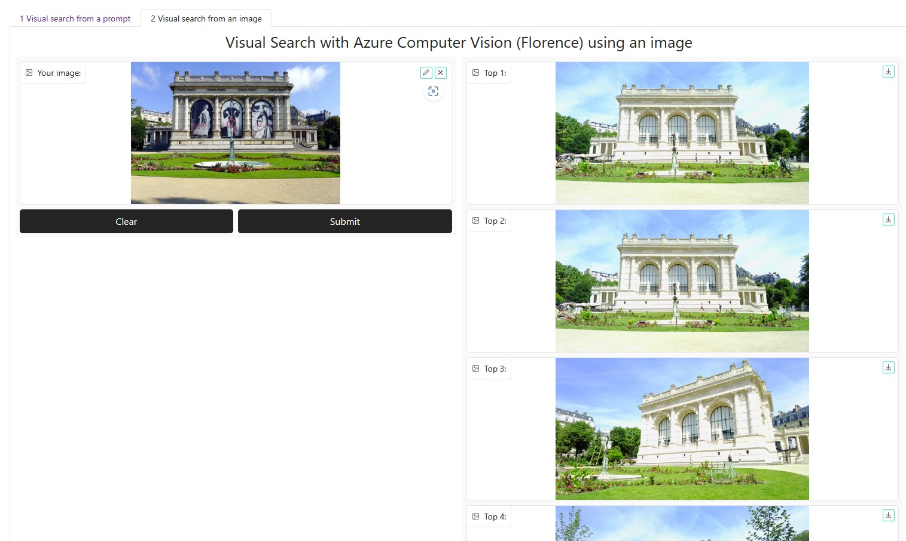

# Video search with Azure Computer Vision 4 (Florence)

A quick prototype of a video analytics solution to analyse content from a video.

## Process
- Frames extraction from a video file using OpenCV
- Images vectors embeddings of all the frames using Azure Computer Vision 4
- Visual search using a reference image or a prompt
- An example of a webapp for video search

## Some screenshots of the webapp

## Documentation
https://learn.microsoft.com/en-us/azure/cognitive-services/computer-vision/overview

12-May-2023 Serge Retkowsky | serge.retkowsky@microsoft.com | https://www.linkedin.com/in/serger/
